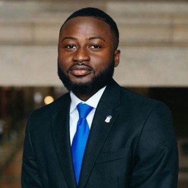

## Melvin Coleman  
Statistician, Continuous Quality Improvement  
Division of Research and Optimal Patient Care  
[American College of Surgeons (ACS)](https://www.facs.org/quality-programs/?page=1)  
633 N St Clair St  
Chicago, IL 60611

</b>
 

## About 

I hold a Bachelor of Arts degree in Biology, Society, and Environment with a minor in Public Health from the University of Minnesota-Twin Cities, awarded in 2020. Subsequently, I pursued advanced studies and earned a [Master of Public Health degree in Epidemiology](https://www.publichealth.columbia.edu/academics/degrees/master-public-health/columbia-mph/mph-epidemiology) with a [Certificate in Applied Biostatistics and Public Health Data Science](https://www.publichealth.columbia.edu/academics/degrees/master-public-health/certificates/applied-biostatistics-and-public-health-data-science) from the prestigious Mailman School of Public Health. 

I have transitioned into a professional role as a Statistician at a nonprofit organization. In this capacity, I apply a rigorous skill set in data science, statistical analysis, and epidemiological methodologies to inform evidence-based decision-making. My work is dedicated to addressing real-world public health challenges and contributing to meaningful research initiatives aimed at improving community health outcomes.

I currently work as a Statistician for the American College of Surgeons, concentrating on elevating surgical quality and outcomes through the National Surgical Quality Improvement Program (NSQIP).In my current position, I leverage an extensive skill set in data science, statistical analysis, and epidemiological methodologies to steer evidence-based decision-making. and research.

 Please see my [Resume](documents/Coleman, Melvin (Technical Resume).pdf) for more information about my academic and professional experience.

 

## Contact Information 
Melvin Coleman   
Newark, NJ   
Email: [melvinobcoleman@gmail.com](mailto:mbc2178@cumc.columbia.edu)  
LinkedIn: [https://www.linkedin.com/in/melvin-coleman-719244141](https://www.linkedin.com/in/melvin-coleman-719244141)  
GitHub: [https://github.com/mcmvp9](https://github.com/mcmvp9)

</body>

