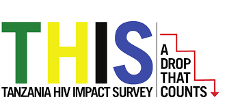

<html lang="en">

</head>
<body>

<h2>RECENT PROJECTS </h2>

Thesis Project (In Progress)  
Examining the association between adult male circumcision   and hepatitis B and C in Tanzania
</bold>  

&nbsp;

[Predicting Goals Scored in the FIFA World Cup Since 1990](https://mcmvp9.github.io/p8105_finalproject/)</bold>  

&nbsp;

[The Tanzania HIV Impact Survey 2022-2023](https://icap.columbia.edu/news-events/building-community-building-skills-columbia-student-collaborates-on-tanzania-population-based-hiv-impact-assessment-survey/)</bold>  

   

&nbsp;
&nbsp;

</body>
</html>

